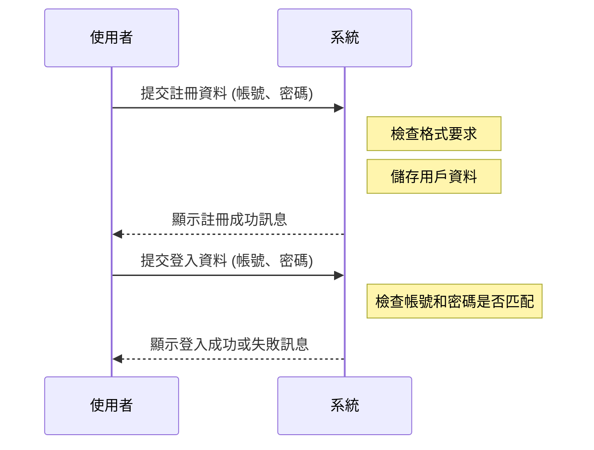

# Java-MySQL-Login

## 專案介紹

此專案用意在於建立一個用戶登入系統，允許使用者註冊帳號、登入系統。<br/>
登入系統使用 Java 搭配 JDBC 與 MySQL 進行資料庫操作。<br/>
進行註冊時，系統會檢查帳號和密碼是否符合格式要求，並將資料儲存於 MySQL 資料庫中。<br/>
登入時，系統會比對輸入的帳號與密碼是否匹配 MySQL 資料庫中的資料，並返回驗證結果。<br/>

## 系統架構圖


## 功能介紹
1. 用戶註冊：<br/>使用者可以註冊新帳號，提供用戶名和密碼。系統會檢查帳號和密碼是否符合格式要求
3. 用戶登入：<br/>使用者可使用已註冊的帳號與密碼登入。系統會比對資料，若匹配則登入成功。


## 用戶流程


## 安裝步驟
### 前置準備：

* JDK (Java Development Kit)：確保安裝 JDK 22 版本
* Git：安裝 Git，用於拉取專案代碼
* MySQL：安裝MySQL，用於建構資料庫

### 拉取專案：
```
git clone https://github.com/y2kaug27th/Java-MySQL-Login.git
```
### 資料庫設置：
在 ```Java-MySQL-Login\src\db\MyJDBC.java``` 中，更改資料庫設置以確保 Java 應用程式能夠正確地連接到 MySQL 資料庫，其中包括設定資料庫 URL、用戶名稱以及密碼。

### 運行專案：

```
java Java-MySQL-Login\src\AppLauncher.java
```
